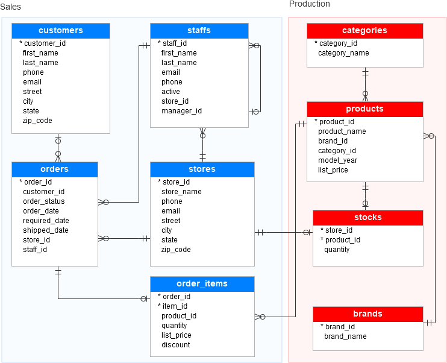

# SQL Data Analysis on Sales and Production

## Project Overview
This project showcases SQL-based data analysis on sales and production datasets. Through a series of SQL queries, the analysis extracts valuable insights such as top-performing stores, most popular products, revenue drivers by category, and customer ordering patterns. This project demonstrates the power of SQL in uncovering key business metrics and supporting data-driven decision-making.

## Features
- **Sales Analysis**: SQL queries to identify average orders per customer, revenue by category, and best-performing stores.
- **Production Analysis**: Insights into product popularity, inventory levels, and stock distribution across stores.
- **Key Metrics**: Calculation of average prices, total revenue, total orders, and other important KPIs.
- **Optimized Queries**: Queries are optimized for performance, ensuring efficient data retrieval even on large datasets.

## Dataset Overview
The analysis uses a relational dataset with the following tables:
- **Customers**: Details about each customer, including contact information.
- **Orders**: Records of each order, including status, dates, and associated store and staff IDs.
- **Order Items**: Details of each product in an order, including quantity, list price, and discount.
- **Products**: Information on each product, including category, brand, and pricing.
- **Stocks**: Data on product stock levels across stores.
- **Stores**: Information about each store, including location and contact details.
- **Categories and Brands**: Metadata about product categories and brands.
- 

